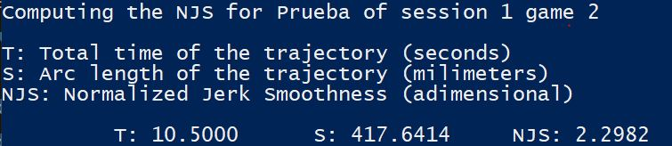
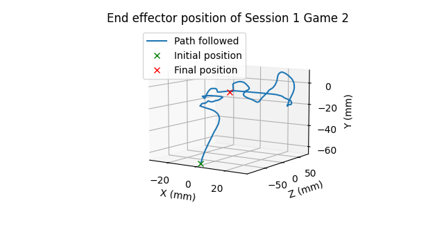

# Trajectory metrics

This repository contains the code necessary to quantify and visualize
trajectory followed by the user on the serious game *Add link to a youtube video later*

To quantify the "quality" of user trajectory I used a metric based on
the smoothness, which uses the jerk called Normalized Jerk Smoothness(NJS) 
*Add link referencing the papers where that computation is showed*

To visualize the trajectory of the user a Python script was used.

## Project organization

The project has 3 folders

1. data: has the user trajectory information on .csv format. 
2. ComputationNJS: has the code to compute the NJS from the user trajectory using C#.
3. GraphTrajectories: has the code to visualize the user trajectory using Python.

## Run the program

For both programs it is assumed that the data is stored one level up 
from where main file is.

### Computation of NJS using C# code
Assuming we have the .exe file of the * main.cs * file and it is called * ComputeNSJ.exe *, we just need to call the program with 3 arguments which correspond to name of the patient, number of session, number of game.

For example, if we want to compute the information for patient "Prueba", 
with session "1" and game "2" we should call

`./ComputeNJS.exe Prueba 1 2`
 
And a picture like the following should appear as output:

 

### Plot of the trajectories using Python code
The same arguments apply for python code. So If we want to visualize the
same information as the previous code we should call

`python main.py Prueba 1 2`

And a picture like the following should appear as output:

